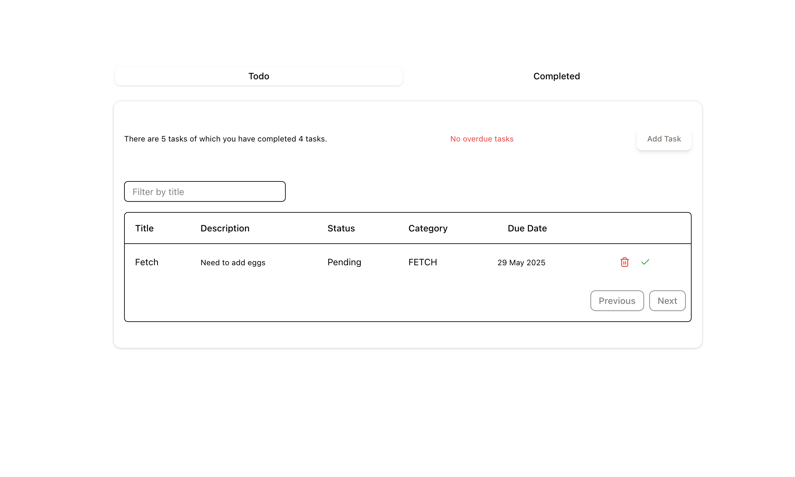

# Spry Todo List

A modern, minimal, and responsive Todo List app built with React, Redux, and Tailwind CSS.



## Features

- Add, edit, and delete todos
- Mark tasks as complete or pending
- Filter and sort todos by title, category, status, or due date
- Responsive design for mobile and desktop
- Overdue task highlighting
- Pagination for large lists
- Tooltips for long descriptions
- Accessible and keyboard-friendly UI

## Tech Stack

- **React** – UI library
- **Redux** – State management
- **Tailwind CSS** – Utility-first styling
- **shadcn/ui** – Accessible UI components
- **date-fns** – Date formatting and parsing
- **TanStack Table** – Advanced table features

## Getting Started

1. **Install dependencies:**
   ```bash
   npm install
   ```
2. **Start the development server:**
   ```bash
   npm run dev
   ```
3. Open [http://localhost:5173](http://localhost:5173) in your browser.

## Project Structure

```
src/
  components/
    Board.jsx
    TodoList.jsx
    Summary.jsx
    todotable/
      columns.jsx
      data-table.jsx
  redux/
  assets/
  App.jsx
  main.jsx
```

## Customization

- Update categories, statuses, and UI in the `columns.jsx` and Redux slice as needed.
- Change the theme by editing Tailwind or shadcn/ui config.

## License

MIT

---

Made with ❤️ by azgardians
